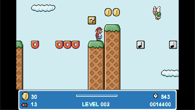

# Oiram
This is a Prizm port of Oiram. The port was written using the PrizmSDK and adapted from the original TI-84+ CE version. The original Oiram is a mario-style platformer programmed from scratch in C and assembly using the CE development toolchain.

You can find the complete original readme [here](https://github.com/mateoconlechuga/oiram/blob/master/extra/readme.md).
There's also a handy level editor [here](https://github.com/mateoconlechuga/oiram-editor/releases/latest).

## Installation

Download the latest release [here](https://github.com/tswilliamson/oiram/releases)

Copy the Oiram.g3a, OiramS.8xv, OiramT.8xv, and OiramPK.8xv files to the file root of your Prizm calculator. You should now find the Add-In installed on your calculator home screen.

## Keys

The default keys are:

    [SHIFT] Jump
    [OPTN] Run/Attack
    [Arrow Keys] Move/Duck
    [EXE] Pause
    [MENU] Exit

With the exception of MENU, these keys can be reconfigured by pressing OPTN in the level select screen.

## Compatibility

This version should be compatibile with the FX-CG10, FX-CG20, FX-CG50, and Graph 90+ E Casio calculators. It also is fully compatible with any custom levels made for the 84+ CE version.

## Building

My other repository, PrizmSDK, is required to build Oiram from source. Put your Oiram clone in the SDK projects directory. The sprite and tile files should be built using mateo's [original repository](https://github.com/mateoconlechuga/oiram)

To build on a Windows machine, I recommend using the project files using Visual Studio Community Edition, where I have NMAKE set up nicely. For other systems please refer to your Prizm SDK documentation on how to compile projects. The source requires configuration options via defines in your make command, such as:

`make DEFINES="-DTARGET_PRIZM=1 -DDEBUG=0" CONFIG=DeviceRelease`

